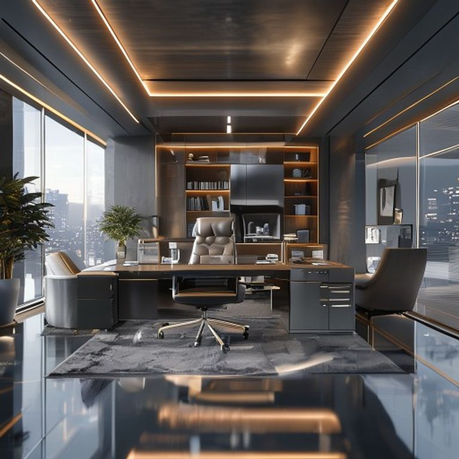

# Liquid Atelier AI Engine 🔮📐

An advanced generative AI full-stack pipeline that transforms traditional architectural spaces into high-end, computational **Liquid Architecture** layouts. Built with a robust FastAPI asynchronous/synchronous routing backend and a highly responsive Next.js frontend wrapper.

---

## 🚀 Before / After Transformation

| Original Base Canvas | AI Morphed Masterpiece (Liquid Architecture) |
| :---: | :---: |
|  |  |

*Note: Replace the image source paths with your actual asset links once you commit your sample images to the repo!*

---

## 🛠️ System Architecture & Tech Stack

### Backend Infrastructure (FastAPI)
- **High Performance:** Async route design to manage heavy multipart image form data effortlessly.
- **Headless Pipeline:** Custom dynamic network abstraction integrated with the **Flux Engine (Latent Diffusion)** via distributed serverless structures.
- **CORS Middleware:** Secured and tailored cross-origin access rules for strict frontend interaction.

### Frontend Layer (Next.js 14)
- **Framework:** Next.js with React 18 for server-side stability and optimization.
- **State Management:** Reactive component rendering with real-time feedback loops for long-polling API cycles.

---

## ⚡ Quick Setup & Installation

### 1. Backend Setup
```bash
cd backend/app
python -m venv venv
source venv/bin/activate  # On Windows use: venv\Scripts\activate
pip install -r requirements.txt
python main.py
